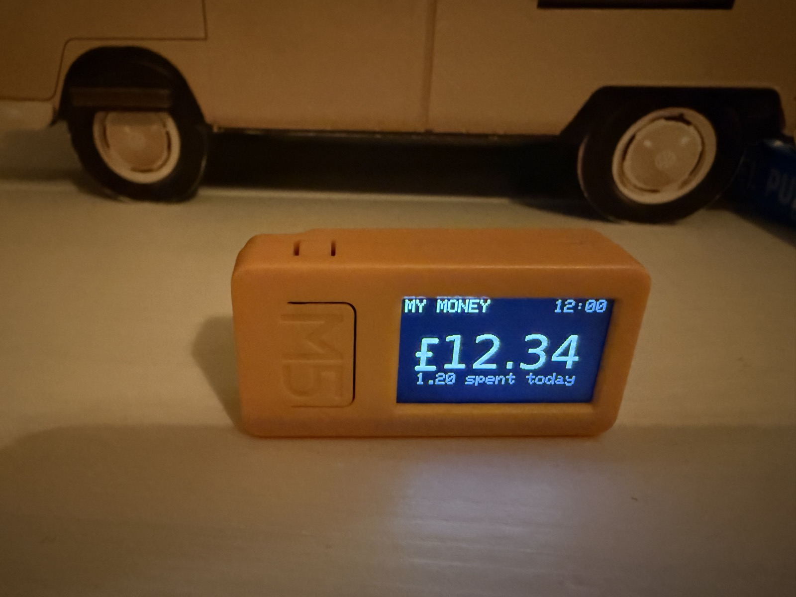
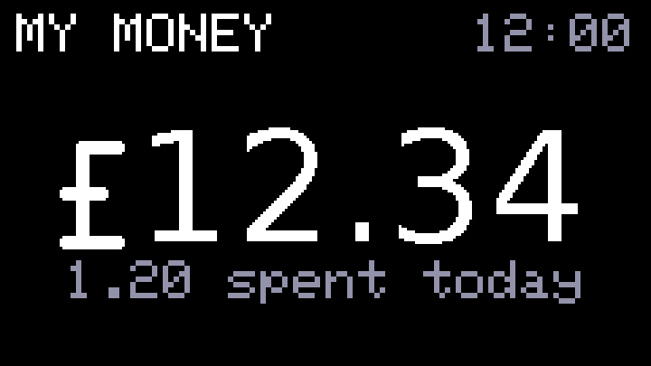
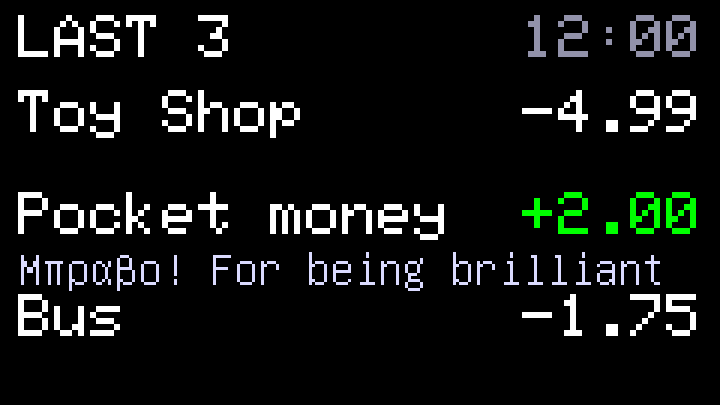
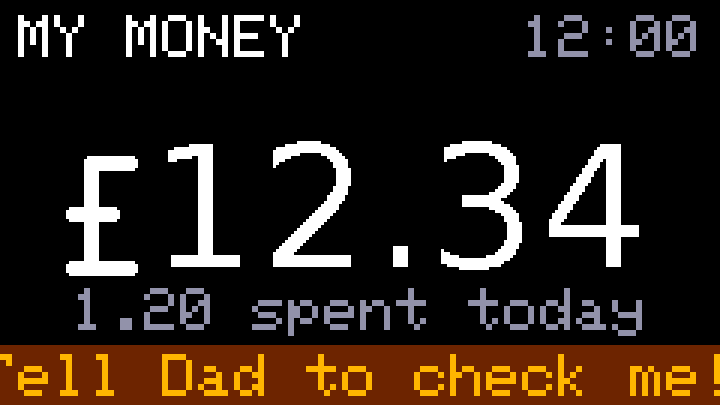
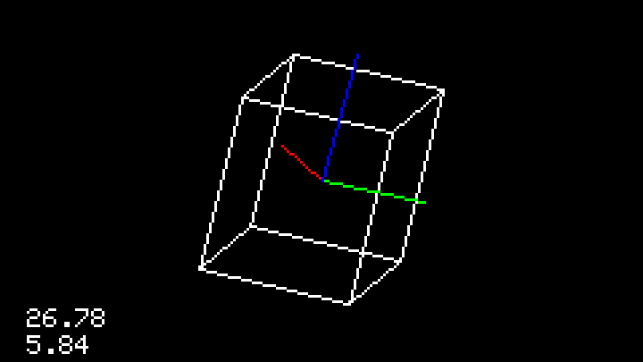

# monzo-kid-balance

A tiny desk gadget that shows a kid their Monzo pocket-money balance — and their
last three transactions — without needing a phone. It also plays Snake,
steered by tilting.

Built for an [M5StickC PLUS2](https://docs.m5stack.com/en/core/M5StickC%20PLUS2)
(ESP32, 1.14" screen, two buttons) sitting on a child's desk. Press a button to
flip between balance and recent transactions; the side button goes to Snake,
then on to the fun factory demo apps (gyro cube, mic scope, IR remote...) that
ship with the device.

```
┌────────────┐   OAuth2 + refresh    ┌────────────────────┐   HTTPS GET /display   ┌──────────────┐
│ Monzo API  │◄─────────────────────►│ Cloudflare Worker  │◄───────────────────────│ M5StickC     │
│            │──transaction webhook─►│ (tokens, cache,    │   Bearer device token  │ PLUS2        │
└────────────┘                       │  cron poll)        │                        │ (this repo's │
                                     └────────────────────┘                        │  firmware)   │
                                                                                   └──────────────┘
```

## What it looks like



| Balance | Last three, with the sender's message |
|---|---|
|  |  |
| **Can't reach the Worker** — last known balance, and who to tell | **Monzo needs re-approving** (every ~90 days) |
|  |  |

The factory demos survive too — press the side button for the gyro cube and
friends:



(Screenshots are pixel-exact captures from the device, taken with
`scripts/screenshot.py`; the amounts are the built-in demo data.)

## Design principles

- **The device never talks to Monzo.** Monzo OAuth tokens grant far more than
  balance-read, so they live only in Cloudflare (Worker secrets + KV). The device
  gets a single read-only endpoint returning pre-formatted display strings.
- **The endpoint reveals nothing sensitive.** Worst case, someone who steals the
  device token sees a pocket-money balance and three truncated merchant names —
  no account identifiers, no names, and no way to move money.
- **Verified TLS end to end.** The device validates Cloudflare's certificate
  against a bundled root-CA set (no `setInsecure()` shortcuts).
- **No secrets in git, ever.** Worker secrets go in via `wrangler secret put`;
  device WiFi/token/personalisation live in a gitignored `secrets.h`
  (template: `firmware/src/secrets.h.example`).
- **Survives Monzo's quirks.** Single-use refresh tokens are rotated by a single
  writer (the cron) to avoid races; the undocumented ~90-day SCA lapse turns into
  a friendly "ask a grown-up to re-approve" screen plus a daily email (or
  ntfy.sh push) nag, instead of a mysteriously dead gadget.

## Repository layout

| Path        | What it is |
|-------------|------------|
| `worker/`   | Cloudflare Worker (vanilla JS, zero deps): Monzo OAuth, token rotation, webhook + cron cache refresh, `/display` endpoint |
| `firmware/` | PlatformIO firmware for the M5StickC PLUS2 — a vendored copy of M5Stack's factory demo with a Balance app added as the default screen |
| `docs/`     | Notes, including the Monzo API findings that shaped the design |
| `scripts/`  | `update.sh` (deploy, flash, change WiFi — one command each) and `screenshot.py` |

## Keeping it running

Once set up, there are only three things you might ever do, and each is one
command: `wifi` when you move house or change the WiFi password, `worker` to
deploy a Worker change, `device` to flash a firmware change.

```bash
scripts/update.sh wifi
scripts/update.sh worker
scripts/update.sh device
```

`scripts/update.sh --help` says the same thing.

One-time tooling: Node (for `npx wrangler`) and PlatformIO in a project venv:

```bash
python3 -m venv .venv && .venv/bin/pip install platformio
```

## Status

**Live and complete.** The gadget sits on a desk showing a real balance,
updating within a minute of the card being tapped (webhook-driven), with
battery dim/sleep, verified TLS, and friendly screens for every failure mode.
`PLAN.md` records how the build was sequenced and what on-device testing
caught; `docs/spike-notes.md` answers the question this project hinged on
(yes — Monzo Under-16s accounts are fully readable via the parent's API
token); `worker/README.md` documents setup and the accepted security
trade-offs.
